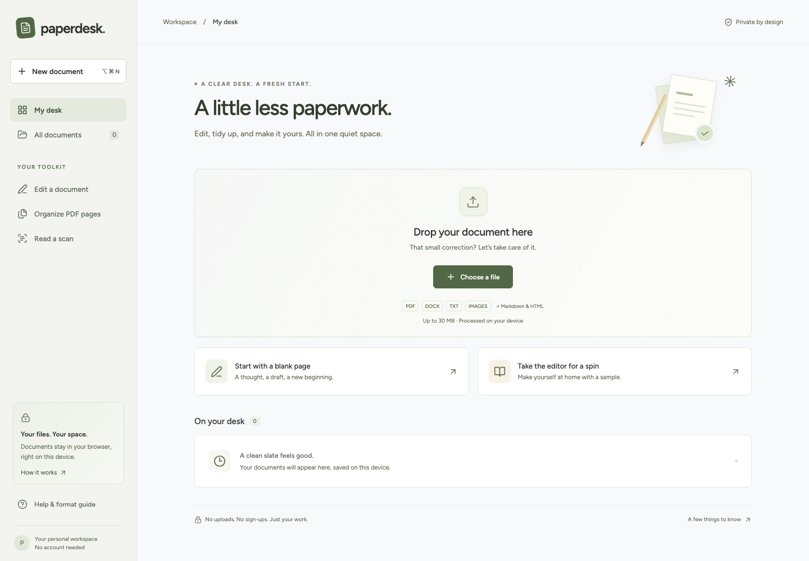

# Paperdesk

A calm, local document editor. Open a file, make a correction, and leave with a new copy.

**[Open Paperdesk](https://paperdesk-omega.vercel.app)** · [Research and supported features](docs/research.md) · [Verification](docs/verification.md)



## What it does

- **Write and format:** open DOCX, TXT, Markdown, and HTML. Edit text, correct names and dates with find and replace, format headings and lists, and insert links, images, and tables.
- **Edit PDF pages and images:** select detected PDF text for visual correction; place text, images, and signatures; erase areas; highlight; draw rectangles; fine-tune position, color, size, and font.
- **Organize:** append, add, rotate, reorder, duplicate, delete, and extract pages.
- **Read scans:** English OCR on the active page, opening the result as a separate writing document.
- **Export:** DOCX, PDF, HTML, TXT, or page PNG, depending on the workspace.
- **Keep drafts locally:** automatic saves in this browser with a visible save state, recovery after reopening, search, and draft deletion.

No account, API key, subscription, or document upload server is required. Files are processed in the browser. OCR downloads engine and language assets when needed; the document itself is not uploaded.

## Run locally

Requires Node.js 22 or newer.

```sh
npm ci
npm run dev
```

Open http://localhost:5178. Production build:

```sh
npm run build
npm run preview -- --port 5178
```

## Verify

```sh
npx playwright install chromium firefox webkit
npm run verify
npm audit --audit-level=high
```

`verify` runs lint, TypeScript checking, the production build, and browser tests. Tests exercise actual imports, corrections, undo, local draft recovery, DOCX package structure, PDF outputs, pixel-level erasing, responsive widths, HTML sanitization, storage failure, page organization, and accessibility. OCR has a real engine smoke test in Chromium; it needs access to its asset hosts.

## Important format limits

PDF editing is visual. Export builds a new PDF from flattened page images, so original text beneath an opaque erase region is not retained in the export. Selectable text, original form fields, hyperlinks, accessibility tags, attachments, and digital signatures are not preserved. The local source draft still contains its original background until deleted. Keep the source file.

The eraser fills an area with a selected solid color. It can clean marks and watermarks on plain backgrounds, but does not reconstruct content hidden beneath them or automatically identify every watermark. There is no universal invisible watermark removal.

DOCX import preserves supported content and structure rather than exact Word layout. Complex layouts, headers, floating objects, comments, tracked changes, footnotes, and document-specific styles are not guaranteed. DOCX export generates a new document. This is not a lossless Office round trip.

OCR is English-only and can make errors. Review names, dates, amounts, and identifiers. A placed signature image is a visual element, not a certified digital signature. PDF font matching is approximate and editable.

Inputs are limited to 30 MB, PDFs to 60 pages, and cumulative rendered pixels to a browser-oriented memory budget. Very large pages, images, or browser storage limits may require smaller files. Legacy `.doc`, spreadsheets, presentations, and encrypted PDFs are not supported. Save legacy Word files as `.docx` first. Browser drafts do not sync across devices or domains.

## Stack

React, TypeScript, Vite, Tiptap/ProseMirror, PDF.js, pdf-lib, Mammoth, docx, DOMPurify, localForage, Tesseract.js, html2pdf.js, Lucide, and locally served Figtree fonts. Heavy editor, parser, and export code loads on demand. Vercel serves the static application with security headers.

## Research and reusable skill

- [Research, engineering constraints, sources, and feature matrix](docs/research.md)
- [Reusable Paperdesk editing skill](skills/paperdesk-editor/SKILL.md)

Install the skill by copying `skills/paperdesk-editor` into your Codex skills directory. It describes mode selection, corrections, cleanup limits, export choices, and output verification.

## Deployment

The repository includes `vercel.json`. Import the GitHub repository into Vercel with the Vite framework preset, or deploy with an authenticated Vercel CLI:

```sh
vercel --prod
```

No environment secrets are required. The GitHub Actions workflow runs the verification suite on pushes to `main` and pull requests.

## License

MIT. Third-party libraries and fonts retain their respective licenses. See [THIRD_PARTY_NOTICES.md](THIRD_PARTY_NOTICES.md).
